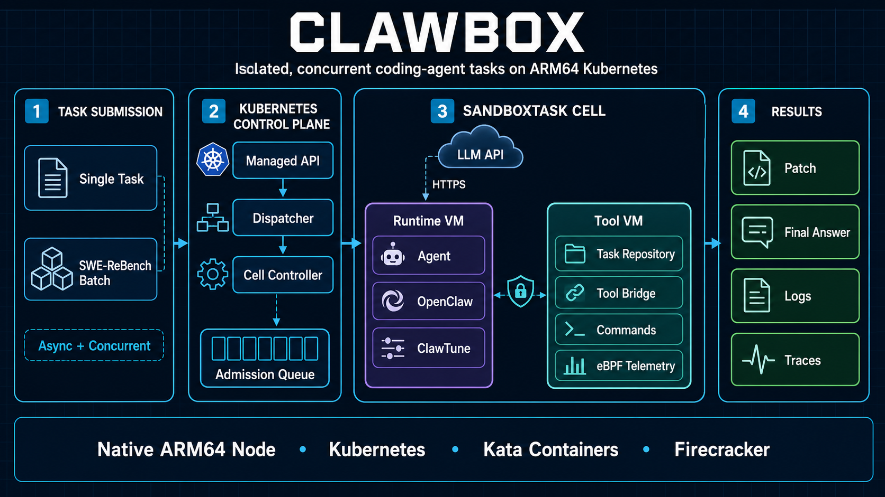
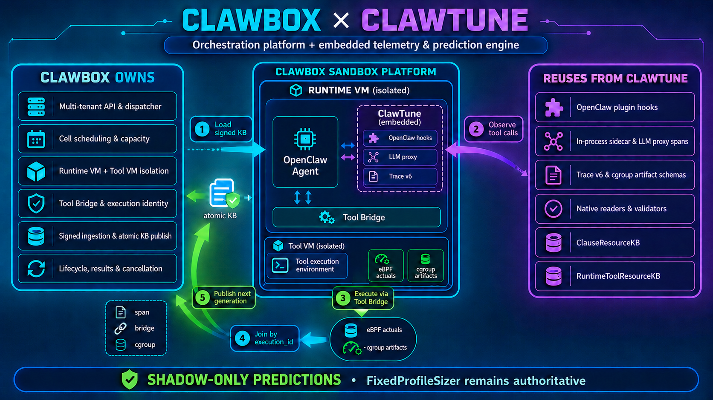

# ClawBox



ClawBox runs coding-agent tasks on one native ARM64 Kubernetes node. Each
task is a `SandboxTask` backed by two isolated Kata/Firecracker VMs:

- the Runtime VM runs OpenClaw and calls the LLM;
- the Tool VM contains the repository and executes tools;
- the Kubernetes controller starts, monitors, and cleans up both VMs.

The supported production target is a dedicated ARM64 host such as Kunpeng.
There is no supported x86, QEMU, runc, or multi-node fallback.

## ClawBox and ClawTune



ClawBox creates and manages the isolated VMs. ClawTune runs inside the Runtime
VM and records LLM calls, tool calls, and resource use. ClawBox stores those
records and makes them available to later tasks from the same tenant and
repository.

The current flow is:

1. A Runtime VM downloads the latest signed measurement data for its tenant and
   repository.
2. ClawTune records LLM and tool activity.
3. ClawBox forwards each tool command to the isolated Tool VM and measures its
   CPU and memory use.
4. ClawBox checks that the records refer to the same tool execution, signs the
   combined result, and stores a new version.
5. Later tasks can load that version for reporting and prediction.

Predictions currently do not change the CPU or memory assigned to production
tasks. Production task sizes still come from fixed profiles. The trace-replay
experiment described later in this README is the first place where an LLM
duration estimate controls VM memory reclamation.

## Table of contents

- [New host: one-time installation](#new-host-one-time-installation)
- [Existing host: start and run tasks](#existing-host-start-and-run-tasks)
- [Replay traces and reclaim idle VM memory](#replay-traces-and-reclaim-idle-vm-memory)
- [Updating an installed host](#updating-an-installed-host)
- [Troubleshooting](#troubleshooting)
- [Lifecycle and development references](#lifecycle-and-development-references)

## Command map

| Situation | Command |
| --- | --- |
| Read-only health check | `scripts/clawbox doctor` |
| Start/reconcile an installed host | `scripts/clawbox up` |
| Submit one task using the installed fixed-image template | `scripts/clawbox submit ...` |
| Run mapped SWE-ReBench tasks, including concurrent batches | `scripts/run-swe-rebench.sh ...` |
| Install ClawBox on an already bootstrapped new host | `scripts/clawbox install ...` |
| Run the trace-replay memory experiment | `python -m clawbox.replay.cli experiment ...` |

All commands below run from the ClawBox checkout on the ARM64 host unless a
section says otherwise. Platform and task images must use immutable
`IMAGE@sha256:...` references.

## New host: one-time installation

Do not repeat this section after the host has been bootstrapped. In
particular, the devmapper `apply` command erases the two disks named on its
command line.

### 1. Requirements

- dedicated openEuler ARM64 host with `/dev/kvm` and cgroup v2;
- Python 3.12+, Git, Docker with Buildx, and outbound access for installation;
- two unused whole disks: one devmapper data disk and one metadata disk;
- ClawBox and ClawTune checkouts owned by the administrator account;
- an image registry reachable by both Docker and Kubernetes;
- an LLM API key, OpenAI-compatible base URL, model name, and provider egress
  CIDR;
- the SWE-ReBench dataset and the pinned SWE-bench harness when building task
  images.

Never use the system disk, a mounted filesystem, or a partition such as
`/dev/sdb1` for devmapper. Use whole, dedicated devices such as `/dev/sdb`.

### 2. Check out and test the release

Replace `/home/USER` with the administrator's home directory:

```bash
cd /home/USER
git clone https://github.com/w20chen/ClawTune.git
git clone https://github.com/w20chen/ClawBox.git
git -C ClawTune checkout --detach 76eab6fa5c6333f4e80901c030f10cab0e4ce605
cd ClawBox

python3 -m venv .venv
source .venv/bin/activate
python3 -m pip install -e '.[dev,postgres]'
python3 -m pytest -q
```

If pip reports `Missing dependencies for SOCKS support` or connection refused
to `127.0.0.1:1080`, the shell has a SOCKS proxy configured but its tunnel is
not running. Either start the intended tunnel or disable that stale proxy for
the current shell before retrying:

```bash
ss -lnt | grep ':1080 ' || true
unset ALL_PROXY all_proxy HTTP_PROXY http_proxy HTTPS_PROXY https_proxy
python3 -m pip install -e '.[dev,postgres]'
```

If the proxy exports come from `~/.bashrc`, remove/comment them when the proxy
is no longer used; otherwise every new shell will fail in the same way. Do not
unset a working proxy on a host that requires it for outbound access.

Release image builds refuse dirty ClawBox or ClawTune checkouts. Commit or
remove local changes before publishing images.

### 3. Inspect and bootstrap the host

Set the exact whole-disk paths, inspect them, and run the read-only plan:

```bash
export DATA_DISK=/dev/DATA_DISK
export META_DISK=/dev/META_DISK

lsblk -o NAME,PATH,SIZE,TYPE,FSTYPE,MOUNTPOINTS
findmnt -rn -S "$DATA_DISK" || true
findmnt -rn -S "$META_DISK" || true

bash scripts/bootstrap-openeuler-arm64.sh plan \
  --devmapper-data-device "$DATA_DISK" \
  --devmapper-meta-device "$META_DISK"
```

Only after independently confirming that both devices are unused and may be
erased, apply the plan:

```bash
sudo bash scripts/bootstrap-openeuler-arm64.sh apply \
  --devmapper-data-device "$DATA_DISK" \
  --devmapper-meta-device "$META_DISK" \
  --confirm-erase "$DATA_DISK,$META_DISK"

bash scripts/install-ebpf-kata-runtime.sh apply
```

The bootstrap installs pinned Kubernetes, containerd, Kata, Firecracker,
Calico, devmapper, the RuntimeClass, and the containerd systemd unit. It also
runs the static host gate and a live Firecracker smoke test before applying
the ready label.

Verify the persistent devmapper setting and host health:

```bash
systemctl cat containerd.service | grep 'DM_DISABLE_UDEV=1'
systemctl show containerd.service -p Environment | grep 'DM_DISABLE_UDEV=1'
sudo bash scripts/bootstrap-openeuler-arm64.sh status
bash deploy/check-host.sh --runtime-class kata-fc-arm64 --require-ready-label
bash scripts/arm64-kata-smoke.sh --runtime-class kata-fc-arm64
```

Both `DM_DISABLE_UDEV` checks must print a match. This prevents libdevmapper
from waiting on stale udev cookies during concurrent VM creation.

### 4. Build and publish platform images

For a registry on the same single node, start it once:

```bash
docker run -d --restart unless-stopped --name clawbox-registry \
  -p 127.0.0.1:5000:5000 \
  -v clawbox-registry:/var/lib/registry registry:2
```

Skip that command when using an existing external registry. Then build on the
native ARM64 host:

```bash
export REGISTRY=127.0.0.1:5000/clawbox
export CLAWTUNE_ROOT="$PWD/../ClawTune"
export TAG="$(git rev-parse --short=12 HEAD)"
export PUSH=1

bash scripts/build-kubernetes-images.sh
```

The build publishes the control-plane, Runtime, and Tool Bridge images and
writes their immutable references to `.artifacts/platform-images.env`.

### 5. Build ARM64 task images and mapping

The batch launcher does not translate x86 images at runtime. Every input task
must have a native ARM64 image recorded in the mapping.

Prepare the following paths:

- `/data/swe-rebench.parquet`: SWE-ReBench dataset;
- `../ClawTune/swe_rebench/tasks.json`: selected task list;
- `/src/SWE-bench-fork`: SWE-bench harness checkout;
- `/data/swe-rebench-arm64-map.json`: mapping output.

```bash
git -C /src/SWE-bench-fork checkout --detach \
  980d0cca8aa4e73f1d9f894e906370bef8c4de8a

python3 -m pip install -e '.[images]'
python3 scripts/build-swe-rebench-arm64.py \
  --dataset /data/swe-rebench.parquet \
  --selection ../ClawTune/swe_rebench/tasks.json \
  --swebench-root /src/SWE-bench-fork \
  --registry "$REGISTRY" \
  --mapping /data/swe-rebench-arm64-map.json \
  --tool-bridge-binary .artifacts/tool-bridge-arm64/tool-bridge \
  --push --fail-fast
```

Every supported mapping entry must contain `platform: linux/arm64` and an
immutable `arm64_image`.

### 6. Configure the LLM and install ClawBox

Resolve the LLM hostname immediately before installation. Do not copy an old
provider IP from a previous run: provider addresses can change. Use one
provider-approved CIDR, or a `/32` for the exact IPv4 address selected by your
network configuration. ClawBox rejects `0.0.0.0/0`.

```bash
getent ahostsv4 api.deepseek.com | awk '{print $1}' | sort -u
```

If this prints several addresses, do not arbitrarily copy the first one: use
the provider/network operator's narrow stable CIDR. The CIDR passed to a batch
must cover the hostname stored in the `clawbox-llm` Secret.

Obtain the base URL and model name from the provider's current documentation.
Do not copy model names from an old installation: providers can rename or
retire them.

Choose one task image from the mapping for the Managed API's default
single-task template, then install:

```bash
read -rsp 'DeepSeek API key: ' CLAWBOX_LLM_API_KEY
echo
export CLAWBOX_LLM_API_KEY
export CLAWBOX_LLM_BASE_URL='https://PROVIDER_BASE_URL'
export CLAWBOX_LLM_MODEL='PROVIDER_MODEL_ID'
export CLAWBOX_OPENCLAW_MODEL_REF='vllm/PROVIDER_MODEL_ID'
export CLAWBOX_TOOL_IMAGE='127.0.0.1:5000/clawbox/TASK@sha256:DIGEST'
read -rp 'Approved provider CIDR (for example 203.0.113.10/32): ' \
  CLAWBOX_LLM_EGRESS_CIDR
export CLAWBOX_LLM_EGRESS_CIDR

scripts/clawbox install
scripts/clawbox doctor
unset CLAWBOX_LLM_API_KEY
```

`install` stores credentials in Kubernetes Secrets, initializes persistent
SQLite by default, applies all five ClawBox deployments, and waits for them to
be ready. Set `CLAWBOX_DATABASE_URL=postgresql+psycopg://...` before install
when PostgreSQL is required.

### 7. First concurrency smoke test

Start with two tasks and a 120-second agent budget:

```bash
mkdir -p .artifacts
.venv/bin/python scripts/make-concurrency-smoke-tasks.py \
  --tasks ../ClawTune/swe_rebench/tasks.json \
  --arm64-map /data/swe-rebench-arm64-map.json \
  --count 2 \
  --output .artifacts/concurrency-smoke-2.json

RUN_ID="smoke-$(date -u +%Y%m%d%H%M%S)"

bash scripts/run-swe-rebench.sh \
  --tasks .artifacts/concurrency-smoke-2.json \
  --arm64-map /data/swe-rebench-arm64-map.json \
  --llm-egress-host api.deepseek.com \
  --parallelism 2 \
  --timeout-seconds 120 \
  --command-timeout-seconds 120 \
  --run-id "$RUN_ID"
```

The agent budget is exactly 120 seconds. VM startup and bounded result
collection happen outside that agent budget, so total wall-clock time is
longer. Increase concurrency only after `scripts/clawbox doctor` still passes
and the node has no `DiskPressure`.

## Existing host: start and run tasks

Use this section after every reboot and for normal daily operation. Never
repeat the disk bootstrap.

### 1. Start and verify

```bash
cd /home/USER/ClawBox
scripts/clawbox up
scripts/clawbox doctor
```

`up` starts containerd, kubelet, and Docker when needed, reapplies the saved
immutable image configuration, runs database migrations, and waits for all
five deployments. It does not partition or erase disks.

Before a large batch, also check node pressure and recent sandbox failures:

```bash
kubectl get nodes
kubectl describe node | grep -A2 -E 'DiskPressure|MemoryPressure|PIDPressure'
kubectl -n clawbox-benchmarks get events --sort-by=.lastTimestamp \
  | grep -E 'FailedCreatePodSandbox|devmapper' | tail -20 || true
```

### 2. Run an 8-concurrency, 2-minute batch

For an infrastructure concurrency smoke, generate eight uniquely named copies
of the first task present in the ARM64 mapping. This validates concurrent VM
creation and LLM calls; repeated tasks are not valid benchmark scores.

```bash
mkdir -p .artifacts
.venv/bin/python scripts/make-concurrency-smoke-tasks.py \
  --tasks ../ClawTune/swe_rebench/tasks.json \
  --arm64-map /data/swe-rebench-arm64-map.json \
  --count 8 \
  --output .artifacts/concurrency-smoke-8.json

export RUN_ID="swe-$(date -u +%Y%m%d%H%M%S)"

bash scripts/run-swe-rebench.sh \
  --tasks .artifacts/concurrency-smoke-8.json \
  --arm64-map /data/swe-rebench-arm64-map.json \
  --llm-egress-host api.deepseek.com \
  --profile small \
  --parallelism 8 \
  --timeout-seconds 120 \
  --command-timeout-seconds 120 \
  --run-id "$RUN_ID"
```

`--parallelism 8` allows eight tasks to be active. The controller deliberately
staggers new VM materialization across reconciliation cycles; this reduces
devmapper pressure without reducing steady-state concurrency. A task may stay
`Queued` until capacity for both of its VMs is available.

`--llm-egress-host` resolves every current public IPv4 address immediately
before submission. The launcher rejects private, loopback, malformed, empty,
or excessive results, records the canonical `/32` snapshot in every
`SandboxTask`, and limits Runtime egress to those addresses on port 443. This
removes per-run CIDR input while remaining fail-closed. Re-run the launcher for
each batch so provider DNS changes are captured; never replace this with
`0.0.0.0/0`.

The runner clears inherited HTTP(S)/SOCKS proxy variables only in its own
process before connecting to the local Kubernetes API. This prevents a stale
login-shell proxy from breaking submission and does not modify shell startup
files or Runtime network policy.

For real SWE-ReBench evaluation, first build mappings for every selected task,
then pass the original task file and optionally `--sample N`. The launcher
fails closed when any selected task lacks an ARM64 mapping.

The foreground command waits for the batch. To survive SSH disconnects:

```bash
mkdir -p .artifacts

nohup bash scripts/run-swe-rebench.sh \
  --tasks .artifacts/concurrency-smoke-8.json \
  --arm64-map /data/swe-rebench-arm64-map.json \
  --llm-egress-host api.deepseek.com \
  --profile small \
  --parallelism 8 \
  --timeout-seconds 120 \
  --command-timeout-seconds 120 \
  --run-id "$RUN_ID" \
  >".artifacts/${RUN_ID}.results.json" \
  2>".artifacts/${RUN_ID}.log" </dev/null &

echo $! >".artifacts/${RUN_ID}.pid"
echo "$RUN_ID"
```

Monitor independently of the launcher process:

```bash
kubectl -n clawbox-benchmarks get sandboxtasks \
  -l "clawbox.openai.com/run=${RUN_ID}" \
  -o custom-columns='NAME:.metadata.name,INSTANCE:.metadata.annotations.clawbox\.openai\.com/original-instance-id,PHASE:.status.phase,OUTCOME:.status.outcome,REASON:.status.reason'
```

Add `-w` to watch. Tool and Runtime Pods are deleted after collection;
`SandboxTask` remains as the audit record.

Cancel all active tasks in the batch:

```bash
while read -r task; do
  kubectl -n clawbox-benchmarks patch "$task" \
    --type=merge -p '{"spec":{"desiredState":"Cancelled"}}'
done < <(kubectl -n clawbox-benchmarks get sandboxtasks \
  -l "clawbox.openai.com/run=${RUN_ID}" -o name)
```

Stopping the local launcher does not cancel tasks already created in the
cluster.

### 3. Submit one asynchronous Managed API task

This path always uses the fixed task image stored in template
`swe-rebench-arm64`. Use it only when that image matches the requested
repository. Use the mapped batch runner above when the task image varies by
instance.

Inspect the saved template:

```bash
kubectl -n clawbox-system get secret clawbox-managed \
  -o jsonpath='{.data.templates}' | base64 -d
echo
```

Submit and keep the returned `runId`:

```bash
scripts/clawbox submit \
  --input-ref INSTANCE_ID \
  --problem-file /path/to/problem-statement.txt \
  --deadline-seconds 120
```

Submission is asynchronous. Manage it with:

```bash
scripts/clawbox status RUN_ID
scripts/clawbox attempts RUN_ID
scripts/clawbox events RUN_ID
scripts/clawbox watch RUN_ID --timeout 900
scripts/clawbox cancel RUN_ID
```

Ctrl+C stops only the local watcher. `retry RUN_ID` creates a new attempt for
a finished run. Use `--idempotency-key KEY` only when retrying the same HTTP
submission after an uncertain client/network failure.

### 4. Retrieve task results

Set `TASK_ID` to the `SandboxTask` name:

Export all archived trace files with one host command. It obtains the
cluster credential, creates a temporary local connection, downloads and checks
the files, and closes the connection automatically:

```bash
TASK_ID='swe-run-id-instance-hash'
scripts/clawbox traces "$TASK_ID"
```

Files are written below `.artifacts/${TASK_ID}.traces/`. This includes JSONL,
eBPF clause telemetry, cgroup resource records, and generated reports when the
task uploaded them. Pass a second argument to select another output directory.
The lower-level API sequence below is kept for diagnostics and manual result
retrieval.

```bash
mkdir -p .artifacts
TASK_ID='swe-run-id-instance-hash'
TOKEN="$(kubectl -n clawbox-system get secret clawbox-control-plane \
  -o jsonpath='{.data.service-token}' | base64 -d)"

kubectl -n clawbox-system port-forward service/clawbox-ingester 8084:8084 \
  >.artifacts/ingester-port-forward.log 2>&1 &
PORT_FORWARD_PID=$!

for _ in $(seq 1 30); do
  curl -fsS http://127.0.0.1:8084/healthz >/dev/null && break
  sleep 1
done
curl -fsS http://127.0.0.1:8084/healthz >/dev/null

curl -fsS -H "Authorization: Bearer ${TOKEN}" \
  "http://127.0.0.1:8084/v1/archive/${TASK_ID}/result" \
  -o ".artifacts/${TASK_ID}.result.json"
curl -fsS -H "Authorization: Bearer ${TOKEN}" \
  "http://127.0.0.1:8084/v1/archive/${TASK_ID}/traces" \
  -o ".artifacts/${TASK_ID}.traces.json"

# The traces endpoint above returns a manifest. Download every archived JSONL
# file listed by that manifest, preserving its relative directory structure.
TASK_ID="${TASK_ID}" TOKEN="${TOKEN}" .venv/bin/python - <<'PY'
import json
import os
import urllib.parse
import urllib.request
from pathlib import Path, PurePosixPath

task_id = os.environ["TASK_ID"]
token = os.environ["TOKEN"]
manifest_path = Path(".artifacts") / f"{task_id}.traces.json"
output_root = Path(".artifacts") / f"{task_id}.traces"
manifest = json.loads(manifest_path.read_text(encoding="utf-8"))

for relative, metadata in sorted(manifest["paths"].items()):
    if not relative.endswith(".jsonl"):
        continue
    parts = PurePosixPath(relative).parts
    if not parts or any(part in {"", ".", ".."} for part in parts):
        raise ValueError(f"unsafe trace path: {relative!r}")
    url = (
        "http://127.0.0.1:8084/v1/archive/"
        f"{urllib.parse.quote(task_id, safe='')}/traces/"
        f"{urllib.parse.quote(relative, safe='/')}"
    )
    request = urllib.request.Request(
        url, headers={"Authorization": f"Bearer {token}"},
    )
    with urllib.request.urlopen(request, timeout=60) as response:
        data = response.read()
    expected = int(metadata["bytes"])
    if len(data) != expected:
        raise RuntimeError(
            f"trace size mismatch for {relative}: expected {expected}, got {len(data)}"
        )
    output = output_root.joinpath(*parts)
    output.parent.mkdir(parents=True, exist_ok=True)
    temporary = output.with_name(output.name + ".part")
    temporary.write_bytes(data)
    temporary.replace(output)
    print(output)
PY

kill "$PORT_FORWARD_PID"
unset TOKEN
```

The manifest is saved as `.artifacts/${TASK_ID}.traces.json`. Downloaded JSONL
files are written below `.artifacts/${TASK_ID}.traces/`; this includes nested
paths and `tool-bridge.jsonl` when they were uploaded by the task.

## Replay traces and reclaim idle VM memory

This section describes a research experiment. It is separate from the normal
Kubernetes task path above and does not change how production `SandboxTask`
objects run.

The experiment replays an existing JSONL agent trace. Recorded tool commands
are executed again in a disposable checkout or an existing Tool Pod. An LLM
call is not sent to a GPU; the runner waits for the recorded duration instead.
A small model estimates the LLM duration from request size. If the estimate is
long enough, the runner saves the Firecracker VM state and memory to disk,
stops the Firecracker process, and releases its resident memory. It restores
the VM before the next tool command.

The runner can manage two Firecracker VMs per replay:

- the first represents the agent process that waits for the LLM;
- the optional second tracks the memory and saved state of a tool environment.

In the current prototype, the real tool command is still executed by the
configured local, SSH, or Kubernetes command runner rather than inside that
second VM.

Each VM contains a small state-checking program. Before saving a VM, the runner
records the current LLM request. After restoring it, the runner verifies that
the VM was restored rather than rebooted and that the same request is still in
progress. A tool command runs only after all VMs selected for that LLM call
have passed this check.

The decision rule is intentionally small:

```text
save the VM when:
estimated LLM wait >= configured threshold
and
estimated LLM wait >= save time + restore time + expected page-loading time + margin
```

The default threshold is 20 seconds for the agent VM and 30 seconds for the
tool VM. The tool threshold is higher because tool environments are commonly
larger and cost more to load after restoration.

### What this experiment does not do

- It does not transparently suspend a Kubernetes Pod managed by containerd.
- The optional tool VM is managed directly through the Firecracker API. The
  actual tool command still uses the selected local, SSH, or Kubernetes command
  executor.
- GPU inference and GPU KV-cache placement are simulated metadata. A real GPU
  client can replace the simulator later without changing VM handling.
- Saved VM memory briefly increases host memory use while it is being written.
  Limit concurrent saves and report peak memory as well as average memory.

### Prepare a root filesystem

Run this on the ARM64 experiment host. It requires `gcc`, `debugfs`, the Kata
kernel and disk image, Firecracker, and `/dev/kvm`:

```bash
export REPLAY_ROOT="$PWD/.artifacts/replay"
mkdir -p "$REPLAY_ROOT"

python3 scripts/build-runtime-agent-rootfs.py \
  --base-image /opt/kata/share/kata-containers/kata-containers.img \
  --agent-source clawbox/replay/guest_agent.c \
  --output-rootfs "$REPLAY_ROOT/agent-rootfs.ext4"
```

First verify one save-and-restore cycle with
`scripts/firecracker-runtime-continuity-smoke.py`. Its JSON configuration must
contain the Firecracker binary, kernel, root filesystem, API socket, snapshot
paths, vsock path, CPU set, and NUMA node. A complete configuration example is
in [the experiment guide](docs/high-density-replay.md).

```bash
python3 scripts/firecracker-runtime-continuity-smoke.py \
  --config /path/to/firecracker.json --cycles 2 \
  --expected-resident-mib 128 \
  --output "$REPLAY_ROOT/continuity-result.json"
```

### Inspect and replay a trace

Use an older, separate trace for fitting the duration model:

```bash
python3 -m clawbox.replay.cli inspect trace.jsonl \
  --calibration calibration.jsonl
```

For a local parser and tool-execution check that does not start Firecracker:

```bash
python3 -m clawbox.replay.cli run trace.jsonl \
  --backend local --mode resident --sleep-scale 0 \
  --cwd /tmp/disposable-checkout
```

For the Firecracker experiment, create independent input directories for the
resident baseline and the save/restore run. Never reuse a root filesystem that
has already executed a replay.

```bash
for run_mode in resident snapshot; do
  python3 scripts/prepare-high-density-experiment.py \
    --output "$REPLAY_ROOT/${run_mode}-input" \
    --sessions 8 \
    --workspace-source /path/to/disposable/source-repository \
    --base-commit COMMIT_SHA \
    --rootfs-source "$REPLAY_ROOT/agent-rootfs.ext4" \
    --tool-rootfs-source "$REPLAY_ROOT/agent-rootfs.ext4" \
    --trace /path/to/trace.jsonl \
    --calibration /path/to/calibration.jsonl \
    --memory-mib 512 --guest-agent \
    --guest-touch-mib 128 --tool-guest-touch-mib 256
done
```

The generated manifest assigns separate root filesystems, sockets, snapshot
files, vsock addresses, and CPUs to every VM. Run both modes with the same
number of sessions and the same limits:

```bash
python3 -m clawbox.replay.cli experiment \
  "$REPLAY_ROOT/resident-input/manifest.json" \
  --mode resident --resident-slots 4 --tool-resident-slots 4 \
  --numa-node 0 --output-dir "$REPLAY_ROOT/resident-results"

python3 -m clawbox.replay.cli experiment \
  "$REPLAY_ROOT/snapshot-input/manifest.json" \
  --mode snapshot --resident-slots 4 --tool-resident-slots 4 \
  --snapshot-threshold-s 20 --tool-snapshot-threshold-s 30 \
  --estimated-snapshot-s 0.3 --estimated-restore-s 0.1 \
  --estimated-refault-s 0.5 --safety-margin-s 2 \
  --numa-node 0 --output-dir "$REPLAY_ROOT/snapshot-results"
```

`--resident-slots` and `--tool-resident-slots` limit how many agent and tool
VMs may occupy memory at once. They must be identical in both modes. Bind the
runner and all VM processes to CPUs and memory from one NUMA node; the guide
shows the wrapper used on Kunpeng.

Compare `summary.json` and `rss.json` from both output directories. Report at
least completed sessions, failures, tool exit-code mismatches, wall time,
sessions per hour, average and peak Firecracker RSS, save/restore time, and the
number of times each VM was saved. Run several repetitions before using the
numbers in a paper.

### What has been verified

On the Kunpeng host, an eight-session run kept at most four agent VMs in memory
at once. It used one CPU per VM, 512 MiB per VM, and a 384 MiB touched memory
region. LLM waits were replayed at their full recorded duration. Both modes
completed every session and every tool command with no exit-code mismatch.

| Measurement | Keep all agent VMs in memory | Save idle agent VMs | Difference |
| --- | ---: | ---: | ---: |
| Total time | 213.5 s | 152.7 s | 28.5% lower |
| Completed sessions per hour | 134.9 | 188.6 | 39.8% higher |
| Average Firecracker process memory | 1714.9 MiB | 379.3 MiB | 77.9% lower |
| Peak Firecracker process memory | 1730.1 MiB | 1844.2 MiB | 6.6% higher |

The higher peak occurs while several VM memory files are being written. The
average reduction is useful for capacity, but the peak means save operations
must be rate-limited before this can become a production feature.

A separate two-VM check used a 128 MiB agent environment and a 256 MiB tool
environment. The agent VM was saved during all 24 LLM waits; the higher tool-VM
threshold selected only 6 waits. All six tool-VM restores completed and passed
state checks before the next tool command. Average combined Firecracker memory
fell by 43.0%. That check used LLM waits shortened to one tenth of their
recorded duration, so save/restore overhead made it slower; it demonstrates
correct operation, not a throughput improvement.

Implementation details, the Kubernetes runner example, known limitations, and
the current Kunpeng measurements are in
[docs/high-density-replay.md](docs/high-density-replay.md).

## Updating an installed host

### Deploy new ClawBox code

Build and publish from clean, pinned ClawBox and ClawTune revisions, then let
`up` consume `.artifacts/platform-images.env`:

```bash
source .venv/bin/activate
python3 -m pytest -q

export REGISTRY=127.0.0.1:5000/clawbox
export CLAWTUNE_ROOT="$PWD/../ClawTune"
export TAG="$(git rev-parse --short=12 HEAD)"
export PUSH=1
bash scripts/build-kubernetes-images.sh

scripts/clawbox up
scripts/clawbox doctor
```

Never copy Python source into a running container. Rebuild both the control
plane and Runtime when their code changes; immutable digests prevent stale
tags and bytecode from surviving an update.

### Repair an older containerd unit once

New bootstrap runs already install this configuration. Use these commands
only on an older installed host where the following check prints nothing:

```bash
systemctl cat containerd.service | grep 'DM_DISABLE_UDEV=1'
```

First wait until no ClawBox task Pods or Jobs are active. Then install the
repository-owned unit and restart containerd during a maintenance window:

```bash
kubectl -n clawbox-benchmarks get pods,jobs
sudo install -m 0644 deploy/containerd-clawbox.service \
  /etc/systemd/system/containerd.service
sudo systemctl daemon-reload
sudo systemctl restart containerd
sudo systemctl restart kubelet

systemctl show containerd.service -p Environment | grep 'DM_DISABLE_UDEV=1'
scripts/clawbox up
scripts/clawbox doctor
```

Do not restart containerd while task VMs are running.

## Troubleshooting

### Task stays Queued

```bash
kubectl -n clawbox-benchmarks get sandboxtask TASK_NAME -o yaml
kubectl -n clawbox-system logs deployment/clawbox-cell-controller --tail=300
```

- `PendingAdmission`: waiting for a controller cycle;
- `InsufficientCellCapacity`: insufficient CPU, memory, devmapper storage, or
  Pod capacity for both VMs;
- `DiskPressure=True`: free host disk space before submitting more work.

### Sandbox or devmapper creation fails

Stop submitting new tasks and inspect before deleting anything:

```bash
kubectl -n clawbox-benchmarks get events --sort-by=.lastTimestamp \
  | grep -E 'FailedCreatePodSandbox|devmapper' | tail -100
sudo bash scripts/setup-devmapper-openeuler-arm64.sh status
systemctl show containerd.service -p Environment
df -h /
sudo du -sh /var/crash /var/lib/containerd /var/lib/kubelet 2>/dev/null
```

Do not run global Docker/containerd prune commands. Old crash dumps under
`/var/crash` can be very large; remove only exact files after preserving any
diagnostic data that is still needed.

### Failed Pods accumulated

Preview, then delete only Failed Pods in the named ClawBox namespace:

```bash
python3 scripts/cleanup-failed-pods.py
python3 scripts/cleanup-failed-pods.py \
  --namespace clawbox-system --apply
```

Do not clean unrelated namespaces without identifying their owner and cause.

## Lifecycle and development references

The production Kubernetes controller does not yet suspend running Pods. The
trace-replay experiment above can save and restore directly managed
Firecracker VMs, including an optional second VM representing the tool
environment. Integrating this with containerd and Kata without making
Kubernetes treat the Pod as failed remains future work. See
[ADR 004](docs/adr/004-cell-suspend-resume-boundary.md) for the controller
lifecycle boundary.

Development checks:

```bash
python3 -m pytest -q
cd toolbridge && go test -race ./...
```

- Manual manifest deployment: [deploy/README.md](deploy/README.md)
- Execution and telemetry invariants: [docs/AGENT_GUIDE.md](docs/AGENT_GUIDE.md)
- Capacity scale gate: `scripts/scale-swe-rebench.sh`
- Managed API load test: `scripts/load-test.sh`
