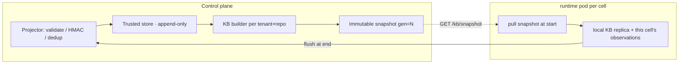

# AGENT HANDOFF 2026-08-19 — ClawTune concurrent ≥32 + tenant×repo KB

> **North star (Definition of Done for this whole effort):**
> ClawTune's observe → KB → shadow-predict loop runs **concurrently on real tasks**
> with **sustained concurrency ≥ 32 cells**, and the KB is **scoped by `(tenant_id, repo_fingerprint)`**
> and **owned by the control plane** (shared across sessions, runtimes, and time gaps),
> with each runtime pod acting as a pull-at-start / flush-at-end replica.
>
> Research target stays: paper on ClawTune resource prediction/tuning from real
> tool-execution observations. M2 security / M3 recovery / M6/M7 GA remain skipped.

---

## 1. Design decision — KB scope is `(tenant, repo)`, control plane authoritative

**Rationale (user decision):** a tenant opens multiple sessions, runs multiple agent
runtimes on the same repo, and repeats work after long gaps. A per-pod KB cannot
accumulate across any of these. So the KB follows the tenant, bucketed by repo.

### 1.1 Model
- **KB primary key = `(tenant_id, repo_fingerprint)`.** One KB per repo per tenant.
- `repo_fingerprint` must be stable across sessions: normalized `git remote origin`
  → fallback to repo directory basename; tasks may pin it explicitly via `CLAWTUNE_REPO_KEY`
  (the runtime plugin already derives it this way).
- All tool-execution observations for that repo — from any session / runtime / point in
  time — are joined (exact `execution_id`, `tuning/join.py`) and accumulated into that
  one KB.

### 1.2 Control plane owns the truth; pods are replicas

- **Start**: sidecar pulls the latest `(tenant, repo)` generation from the control plane and
  seeds the local KB (fallback: image cold-start snapshot). Local in-process KB is a replica
  used for low-latency shadow prediction during the run.
- **Run**: every tool call → local observation → at end-of-session flush back to the projector.
- **Replay**: a runtime started weeks later pulls the accumulated latest generation → repeat
  work sees prior knowledge automatically.

### 1.3 Concurrency semantics (multiple runtimes, same repo, at once)
- Trusted store is **append-only + idempotent dedup** on `(execution_id, tool_name, sequence_no)`
  (already in `tuning/validate.py`). Concurrent writes don't conflict.
- KB snapshots are a **pure function of the trusted observation set**:
  `build(observations) → generation+1`, **immutable, last-writer-wins generation**.
  No shared in-place mutation; a concurrent build just produces an extra rollback-able generation.

### 1.4 Multi-tenant isolation
- Snapshots keyed and isolated by tenant. One tenant's private observations never numerically
  blend into another tenant's KB (preserve the tenant-overlay semantics from
  `clawbox/scheduler/kb.py`). Deleting a tenant must allow rebuilding derived snapshots from raw
  observations (ADR-008 §4).

### 1.5 Shadow-only, fixed profile still sizes cells
- Shadow predictions never change real cell sizing (`FixedProfileSizer` keeps deciding).
  Prediction only records status/events/metrics; offline eval compares prediction vs actual
  (MAE / bucket accuracy / calibration / over-allocation — `tuning/ablation.py`).

---

## 2. Current state (DONE this session — commits pushed)

| Repo | HEAD | What |
|---|---|---|
| ClawBox `main` | `ddd7e7a` | A: tuning research pipeline (7 modules + tests) |
| ClawBox `main` | `b715be3` | C: exact execution_id join + committed-patch extraction |
| ClawTune `v2` | `80d4408` | plugin: hook-only sandbox exec envelope (94 plugin tests green) |

- **C — exact `execution_id` join (complete, local + plugin):**
  - `toolbridge/main.go`: parses `__CBX_EXEC_1__` envelope, adopts runtime `execution_id`
    (backward-compatible `randomID()` fallback), records `execution_source`; `toolbridge/main_test.go` (7 Go tests).
  - ClawTune plugin: new `sandboxExecEnvelope` config (default false, hook-only only) mints
    `exec-<uuid>` and wraps the command in the bridge envelope; `execution_id` flows into span_end.
  - `scripts/runtime-entrypoint.sh`: `"sandboxExecEnvelope": true`.
  - Result: span ↔ bridge join at 100% on well-formed input, no time window.
- **Patch extraction fix (complete):** runtime records tool-VM baseline HEAD before the agent,
  then collects `git diff` (working tree) + `git diff baseline..HEAD` (committed fixes) via a
  heredoc piped over `ssh 'sh -s'`; `tests/test_patch_collect.py` (3 scenarios). Fixes the
  `patch_status=empty` false failure of the task-success metric.
- **A — `clawbox/tuning/` research pipeline (complete, local, tested):**
  `schema.py` (ToolObservation/BridgeRecord, span_end→obs) · `validate.py` (HMAC/quality/dedup) ·
  `join.py` (exact join) · `dataset.py` (command-disjoint + stratified splits, jsonl/parquet export) ·
  `estimators.py` (latency p50/p90 per-command+global, bucket, memory p90+residual, cpu; eval metrics +
  cross_validate) · `kb.py` (immutable generation snapshots, provenance, rollback, serialization) ·
  `ablation.py` (two-scenario ablation vs fixed-profile / global-only / KB).
  - 22 tests in `tests/test_tuning.py`. Full ClawBox suite green (exit 0).
  - Sample ablation result on synthetic data: cold-start learning −97% MAE vs fixed profile;
    known-command KB per-command history another ~−82% MAE, over-allocation 3% vs 75% vs 2719%.

---

## 3. Gaps / blockers (why north star is not met yet)

1. **Real-machine images not rebuilt** with the new tool bridge + plugin (`sandboxExecEnvelope`)
   and the patch-fix entrypoint. Nothing new runs on 193.124.7.2 until images are rebuilt.
2. **KB is not persisted at the control plane.** No projector, no `(tenant, repo)` tables, no
   pull/flush API, no sidecar hooks. `tuning/` is offline-only today.
3. **Concurrency ≥32 is blocked by the FD cliff (~19 cells).** Kata shim resets its soft
   `RLIMIT_NOFILE` to 1024 (hard 524288) → "No file descriptors available (os error 24)" at
   ~19 concurrent cells (`docs/FINDING_2026-08-18-scale32-fd-exhaustion.md`, `scripts/diag-fd.sh`).
4. **Same-image concurrent unpack is not idempotent** (devmapper `AlreadyExists`) → must pre-pull
   the task image once before a 32-cell run.
5. **No offline dataset yet from real traces** — the research eval has only been exercised on
   synthetic data.
6. Postgres image is proxy-blocked → continue with **SQLite** for control-plane persistence
   (production PG manifests/code exist; not needed for the paper).

---

## 4. TODO roadmap (ordered; each phase has acceptance criteria)

### P0 — Rebuild & re-verify on the real machine (foundation)
- Rebuild + push images on 193.124.7.2:
  `bash scripts/rebuild-control-plane-image.sh` (or `build-kubernetes-images.sh` with
  `GOPROXY=https://goproxy.cn,direct`, `NPM_REGISTRY=https://registry.npmmirror.com`,
  `PIP_INDEX_URL=https://pypi.tuna.tsinghua.edu.cn/simple`, `APT_MIRROR=...`).
  The runtime image build consumes `../ClawTune` at `80d4408` → plugin dist rebuilt with the envelope.
- Recreate the M1 smoke stack (API + dispatcher) and submit 1 real task.
- **Accept:** 1 real task Cleaned/Succeeded; `tool-bridge.jsonl` records show
  `execution_source="runtime-envelope"` and ClawTune span_end `execution.execution_id` matches
  the bridge `execution_id` (grep both under the run's `/state/<cell>/traces` + `/testbed/.clawbox`).

### P1 — Control-plane KB persistence (tenant×repo) + projector + API
- New `clawbox/tuning/store.py`: SQLAlchemy/SQLite tables:
  - `tuning_observation` (append-only trusted observations; unique `(tenant_id, repo_fingerprint,
    execution_id, tool_name, sequence_no)`, `payload` JSON, `created_at`)
  - `tuning_kb_snapshot` (per `(tenant_id, repo_fingerprint)` latest + history: `generation`,
    `snapshot` JSON, `input_digest`, `input_count`, `created_at`)
- New `clawbox/tuning/projector.py`: `ingest(tenant, repo, signed_observations)` →
  `ObservationValidator` (HMAC via `ingest_secret`) → dedup → append → rebuild snapshot
  (`KnowledgeBaseBuilder`, generation++) and persist. Idempotent; concurrent-safe (append-only +
  last-writer-wins generation).
- New `clawbox/tuning/server.py` (FastAPI, reuse `require_service_token`):
  - `GET /v1/kb/snapshot?tenant_id&repo` → latest generation snapshot (ClawTune-loadable format, see P2 note)
  - `POST /v1/kb/observations` → signed batch → returns `{generation, accepted, rejected}`
  - `GET /v1/kb/generation?tenant_id&repo`
- Wire into the managed API (or run as a sibling service in `docker-compose.yml` / the control-plane image).
- Tests: concurrent ingest (same repo, N goroutines/threads) → 0 lost observations, generation
  monotonic, rollback works; cross-tenant isolation test (tenant A observations never train tenant B).
- **Accept:** `tests/test_tuning_store.py` + `tests/test_tuning_server.py` green; SQLite file
  survives restart and serves the same generation.

### P2 — Sidecar pull/flush hooks (pod becomes a replica)
- `scripts/runtime-entrypoint.sh` (benchmark mode), when `CLAWBOX_KB_ENDPOINT` + token are set:
  - **start**: `curl GET /v1/kb/snapshot?tenant_id&repo` → seed the ClawTune KB artifact dir
    (write the snapshot into `$ARTIFACT_DIR`). **Note:** the served snapshot must be loadable by
    the pod's ClawTune sidecar (`ClauseResourceKB`/`RuntimeToolResourceKB.to_json_obj`). The
    projector must therefore rebuild the ClawTune-compatible snapshot from trusted
    `ToolObservation`s via the existing ClawTune KB classes (adapter: `ToolObservation` →
    ClawTune `CompletedCall`; all fields exist in `tuning/schema.py`). Research-side `tuning/kb.py`
    snapshots stay the offline/eval format.
  - **end**: after the agent completes, gather this cell's observations (span_end + bridge join,
    `tuning/dataset.build_joined_dataset` on the pod's own traces) → `POST /v1/kb/observations`
    (signed with `ingest_secret`).
- Keep image cold-start fallback when the control plane is unreachable (fail-open).
- **Accept:** a real run's observations appear in `tuning_observation`; a second run on the same
  repo sees a `generation > 0` snapshot at start.

### P3 — Concurrency ≥ 32 (unblock the FD cliff)
- **Root cause:** kata shim resets soft `RLIMIT_NOFILE=1024` (hard 524288). ~19 cells exhaust FDs
  during share-fs/Secret volume setup.
- **Fix (decided):** a tiny **shim wrapper** `containerd-shim-kata-v2` (or a `cgroup`-free wrapper
  earlier in PATH) that calls `setrlimit(RLIMIT_NOFILE, soft=hard)` then `exec`s the real shim;
  install as `/usr/local/bin/containerd-shim-kata-v2` wrapper (keep real binary at a suffixed path).
  Add an **audit gate** to `scripts/audit-kata-firecracker-arm64.sh` (FC-0 style): assert the
  wrapper's effective soft limit ≥ 8192 and that it survives a 32-cell run (`scripts/diag-fd.sh`
  already exists for counting).
- **Run discipline for 32:** pre-pull the task image once
  (`sudo ctr -n k8s.io images pull --snapshotter devmapper `) — same-image concurrent
  unpack is not idempotent; create cells serially or with a small stagger; watch thin-pool
  `Data%` + memory while scaling.
- Parameterize `scripts/m1-concurrent.sh` (`N=32`) and collect a **scale table**:
  N ∈ {1, 2, 4, 8, 16, 24, 32} → success rate / duration / firecracker+shim process counts /
  devmapper Data% / per-cell result. Store under `release-evidence/`.
- **Accept:** a `count=32` run completes with **0 platform failures** (all cells Cleaned with
  Succeeded/Failed by task semantics, none failed due to FD/shim errors), and the scale table
  shows a monotonic resource curve with no cliff before 32.

### P4 — Offline dataset from real traces + estimator eval → paper charts
- Run `tuning/dataset.build_joined_dataset` over the P0/P3 real run traces + bridge JSONLs →
  export train/eval; fit estimators; run `tuning/ablation.run_ablation`; produce charts/tables
  (MAE, bucket accuracy, calibration, over-allocation, cold-start vs known-command).
- **Accept:** a committed `scripts/build-research-dataset.py` (or `python -m clawbox.tuning` CLI)
  + a committed evidence doc under `docs/` with real numbers.

### P5 — North-star demo: 32 concurrent cells sharing one (tenant, repo) KB
- Run N=32 real tasks on the SAME repo; verify: KB generation grows across cells, a late cell
  pulls a higher generation than an early cell, and shadow predictions are recorded per cell.
- **Accept:** end-to-end evidence doc showing 32 cells, monotonic KB generation, and
  prediction-vs-actual rows for the paper.

---

## 5. Repo / file map

| Area | Path |
|---|---|
| Research pipeline | `clawbox/tuning/{schema,validate,join,dataset,estimators,kb,ablation}.py` |
| P1 additions | `clawbox/tuning/{store,projector,server}.py` |
| Runtime entrypoint | `scripts/runtime-entrypoint.sh` (envelope flag, baseline HEAD, patch merge; P2 hooks here) |
| Tool bridge | `toolbridge/main.go` + `toolbridge/main_test.go` |
| ClawTune plugin | `C:\Users\29068\Desktop\ClawTune` `packages/clawtune-plugin/src/*` (envelope) |
| Concurrency evidence | `docs/FINDING_2026-08-18-scale32-fd-exhaustion.md`, `scripts/diag-fd.sh`, `scripts/m1-concurrent.sh` |
| Real-machine manual | `docs/AGENT_HANDOFF_2026-08-19-research-next.md` §3 + repo memory `clawbox-target-machine.md` |

---

## 6. Real-machine ops quick reference

- `ssh weitianc@193.124.7.2` (BatchMode key). **Kubectl/k8s client need NO_PROXY**
  (`export NO_PROXY=localhost,127.0.0.1,193.124.7.2,10.96.0.0/12; unset http_proxy https_proxy all_proxy`).
- Images: `127.0.0.1:5000/clawbox/{control-plane,runtime,tool-bridge}-arm64:dev`;
  task image `swe-rebench-arm64@sha256:bdf4637498...` (contains tool-bridge). Rebuild →
  `nohup bash /tmp/rebuild-control-plane-image.sh` → `cat /tmp/clawbox-build.log`.
- M1 smoke stack: `clawbox-m1-api` (127.0.0.1:8085, SQLite), token `clawbox-m1-smoke-token-0001`,
  tenant `tenant-a`. Submit via `curl -X POST http://127.0.0.1:8085/v1/runs`.
- **Never** inline complex quoting through PowerShell→ssh (write scripts, scp them); never scp over a
  running script; docker output through ssh pty hangs → nohup + log file + cat.

---

## 7. Pitfalls (updated, must read)

1. **FD cliff is the 32 blocker** — fix the shim wrapper BEFORE attempting 32; a scale run that
   ignores it will fail at ~19 and look like a capacity problem.
2. Same-image concurrent unpack not idempotent → **pre-pull once** for any N>1 run.
3. `git diff` misses committed agent work → P0 must confirm the new baseline-HEAD patch collection
   works on the real machine (check `patch_status=present` even when the agent commits).
4. `sandboxExecEnvelope` is **only valid with `executionBackend=hook-only`**; the plugin config
   validator rejects it otherwise. Keep it that way (other ClawTune deployments are unaffected).
5. PG image blocked by proxy → SQLite for control-plane persistence is fine for the paper.
6. Terminal quirk: PowerShell multi-line quoting breaks Python heredocs → always write scripts to
   files and run them; Go/bash tests can only run on the target machine (no local Go/bash/docker).
